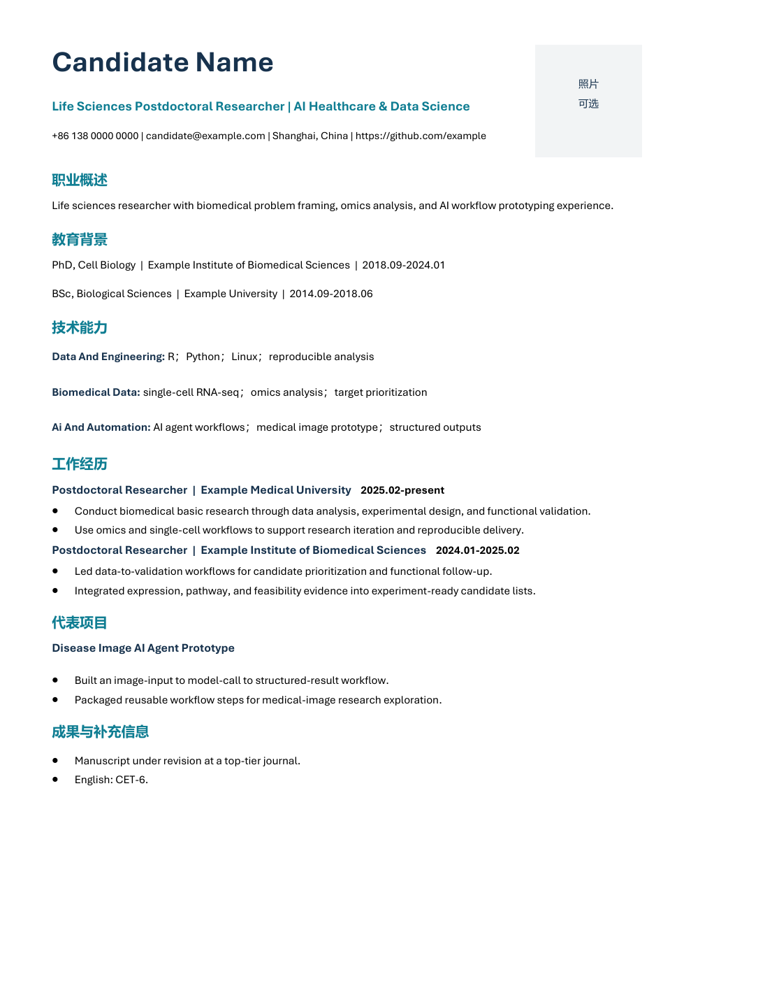
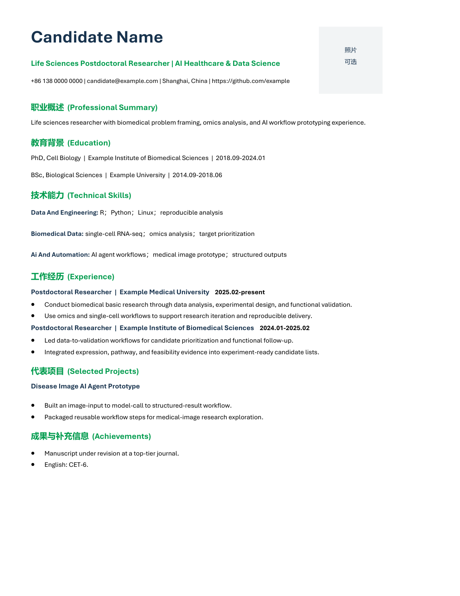

# CV Builder

Version: 0.2.0-beta

Generate, tailor, and visually QA professional resumes for Chinese and English
job applications. CV Builder supports industry, academic, English, and ATS-safe
layouts, plus transparent job-description matching.

The previews use a synthetic candidate profile only.

## What it does

- Validates structured candidate facts before drafting.
- Produces editable DOCX files with clean, ATS-safe single-column layouts.
- Supports industry-cn, original-cn, ats-cn, academic-cn, industry-en, and
  academic-en templates.
- Tailors the headline, summary, skill order, and project framing to a target
  role without inventing facts.
- Optionally exports PDF and checks text, page count, and rendered pages.
- Creates JD evidence reports with matched evidence and unverified gaps.

## Install

~~~powershell
python -m pip install -r requirements.txt
~~~

Copy the repository skill folder to your Codex skills directory and name it
cv-builder. Start from skill/assets/profiles/ai_biomed_anonymized.json, then
replace only the example values with verified facts.

## Quick start

~~~powershell
python skill/scripts/validate_profile.py my-profile.json
python skill/scripts/generate_resume.py my-profile.json --template industry-cn --output resume.docx
python skill/scripts/generate_resume.py my-profile.json --template industry-cn --output resume.docx --pdf
python skill/scripts/qa_pdf.py resume.pdf --must-contain "Candidate Name"
~~~

For an explicit PDF engine:

~~~powershell
python skill/scripts/export_pdf.py resume.docx --engine auto
~~~

Auto export tries LibreOffice first. On Windows it falls back to Microsoft Word
when Word is installed. On macOS and Linux, install LibreOffice or export the
editable DOCX manually.

## Templates

| Template | Intended use | Photo | Notes |
| --- | --- | --- | --- |
| industry-cn | Chinese industry roles | Optional | Concise technical and business-facing layout |
| original-cn | Chinese industry roles | Optional | Green bilingual section headings |
| ats-cn | ATS-sensitive applications | No | Minimal text-first layout |
| academic-cn | Research and academic applications | No | Adds research, publications, funding, service |
| industry-en | English industry roles | No | Compact English layout |
| academic-en | English academic applications | No | Academic English layout |

Template JSON files in skill/assets/styles are the runtime source of truth for
color, font, margin, language, photo, and heading behavior.

## JD matching: what the percentage means

~~~powershell
python skill/scripts/match_jd.py my-profile.json target-jd.txt --output jd-report.json
~~~

coverage_percent is the share of detected JD keyword groups that have matching
evidence in the supplied profile, using transparent aliases such as Scrum and
project management. It is a drafting and prioritization aid, not a recruiter
score, interview probability, or hiring prediction. Missing terms must never
be added unless the candidate verifies the underlying experience.

## Privacy and factual integrity

This repository contains only synthetic examples. Do not commit personal
photos, phone numbers, email addresses, unpublished research, confidential job
descriptions, or identifiable resumes. The generator does not infer missing
facts: add verified information or leave the field out.

For English layouts, supply verified English content in a separate profile.
The generator changes labels and layout but does not machine-translate factual
claims.

## Repository layout

- skill/: the installable Codex skill.
- evals/: anonymized fixtures and acceptance checks.
- docs/screenshots/: anonymized generated previews.
- .github/workflows/: validation CI.

## License

MIT. See [LICENSE](LICENSE).
